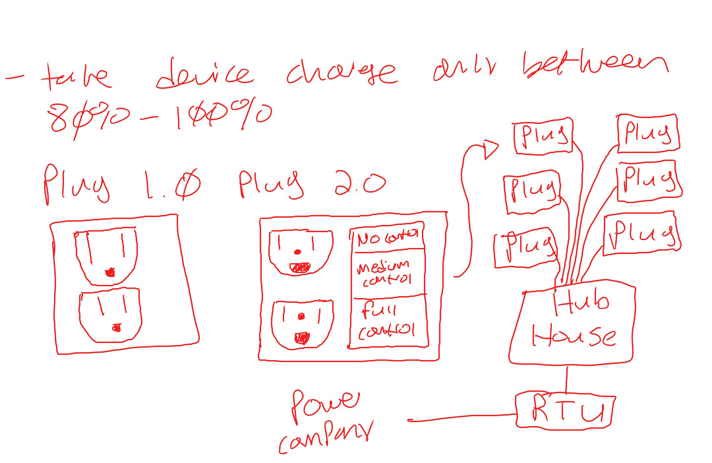

# CloudOverflow

# Table of Contents
1. Overview / TLDR
2. Introduction
3. Demo 
4. Technologies
5. Looking forward 
6. Glossary
7. Contributors

# 1. Overview / TLDR
- We have many devices at home that charge throughout the day and the energy stored stays without being used
- Problem is that the duck curve shows when there is a peak time of solar and wind energy GENERATED is during the times of 9 AM to 5:30 PM and there is nothing to load it 
- Solution is to create HARDWARE (that reads/writes load and generation) and a Management SOFTWARE that charges the devices batteries during those times and gives the ability to customers to sell their battery's charge  (minnimum 20%) after 6 PM (under the assumption that the power is generated through solar and wind)
- Our software shows when is the optimal time to charge, discharge, and sell based on the datasets that we derived

# 2. Introduction

The problem we are trying to address is attempting to flatten the duck curve (figure 1)  
    
    <h7 align="center">(figure 1) California's elictrical fossil fuels demand in a given 24 hour period with solar production subtracting during daytime.</h7>
as much as we can by storing solar power in IOT devices that have batteries which will then be discharged to meet the change in demand.

<h3 align="center"><u><b>Our Example Household</u></b></h3>

| Home Device          | mAh Per Device|Total MW | Household MW Total|
|----------------------|---------------|---------|-------------------|
| Laptop x 4           | 4400          | 0.06512 | 0.58677           |
| Phone  x 4           | 5500          | 0.0792  | 
| Tablet x 4           | 4700          | 0.06768 |
| EV Car x 1           | 9579500       | 0.115   |
| E-Toothbruth x 4     | 2500          | 0.12    |
| Bluetooth Speaker x 2| 7800          | 0.06552 |
| Roomba               | 3300          | 0.07425 |

<h3 align="center"><u><b>Our Assumed Hardware</u></b></h3>
A biderectional four prong plug that connects to a home hub, which is controlled by a power company does not exist yet. If it did exist this is what it might look like: 

<h6 align="center"> This is the theoretical hardware we agreed to base our project on when we started</h6>

# 3. Demo

## data_create_test.py 
- Creates data that we could be getting from the grid in mW, total load on the grid
- Manually put in the data
- Based it on California mW 

## HouseClass.py

- Acts as overall battery of all the devices
- Each house would have a potential charge (Max charge the house can hold), Current charge status (actual amount of charge currently), Current Charge status percentage (Current charge / Potential Charge = Battery Life in percentage)
- Home Owners limit decide how much of percentage they want to sell
- Implemeneted a random shuffle to create mock data based on variables we had listed 

## duck_curve.py

- Opens up mock data of CSV file
- Loop through data and sort it depending on the hour whether it can charge, discharge, or idle
- It determines whether it can be sold based on mW on a specific time
- Able to use HouseClass and its information to use its Values (Battery Capacity, Battery Percentage Limit)

## GUI_main

- Take the proccessed data of the duck curve and visually display when Power can be discharged, charged, or stay idle (Not Charge or Sell)

<h6 align="center">This is our code running, representing a single household</h6>

# 4. Technologies
-     tkinter: The tkinter library is the standard GUI library for Python and provides functions and classes for creating graphical user interfaces (GUIs) for desktop applications. 
- Currently our program doesn't not have an API that it is using, however it has the structure to take an API's data and process it
- An example of a potential API that could be implemented is OpenFMB 
- OpenFMB works with DERs and using that data it could be plugged directly into our program
- Regarding the actual duck curve data, it could be read directly from OSI, meaning it will be trustworthy and meaningful.

# 5. Looking Forward
## Business Aspect

### Based on average household devices and the power they generate

&#9733; 587 kWh battery size of average household 

&#9733; Assuming they are willing to sell 20% of total charge of every device 

&#9733; 117.4 kWh  is 20% of maximum battery charge

&#9733; Found that average price for 1 kWh is 13.3 cents according to U.S. EIA (Energy Information Administration) and Multiply that by 20% of maximum battery charge = &#36;15.6 per day

&#9733; In a month, &#36;468 is a possibiity (This is given the best possible scenario); Most likely it would be 30 to 40 % of the value which = $140 to $187.2 

### **Feasability**

We could : 
- Design and Implement Hardware with a one time fee
- Discount on the electricity bill
- User can choose to Sell Load and receive a percentage of the profits
- Charge based on a percentage cut from the load of the user
- Sell software to the power company

# 6. Glossary
## **Terms**

**RTU**: Stands for remote terminal unit. Monitors and or controls field devices and reports back to a power plant.

**Generation** : Refers to the production of electricity by power plants or other sources of energy

**Load** : Refers to the amount of electricity that is being consumed by the users of the grid at any given time

**Idle** : Refers to the state of power plants or other sources of electricity when they are not producing any power.

**Charge** : Refers to the movement of electrical energy through the system 

**Discharge** : Refers to the release of electrical energy from an energy storage system or a device that has been charged
 
**Duck Curve** : Term used to describe a graphical representation of the difference between electricity supply and demand over the course of a typical day on the power grid

**Grid data** : Pulled from the Duck Curve

**IoT** : Internet of Things, refers to the network of physical devices, vehicles, home appliances, and other items that are embedded with electronics, software, sensors, and connectivity, which allows them to connect and exchange data over the internet

<h2><b>7. Contributers</b></h>
<h3>Abdinasir Mumin</h3>
<h3>Brendan Chermack</h3>
<h3>Calvin Schemeichal</h3>
<h3>Sharveen Paramiswaran</h3>
<h3>William Munnich</h3>

