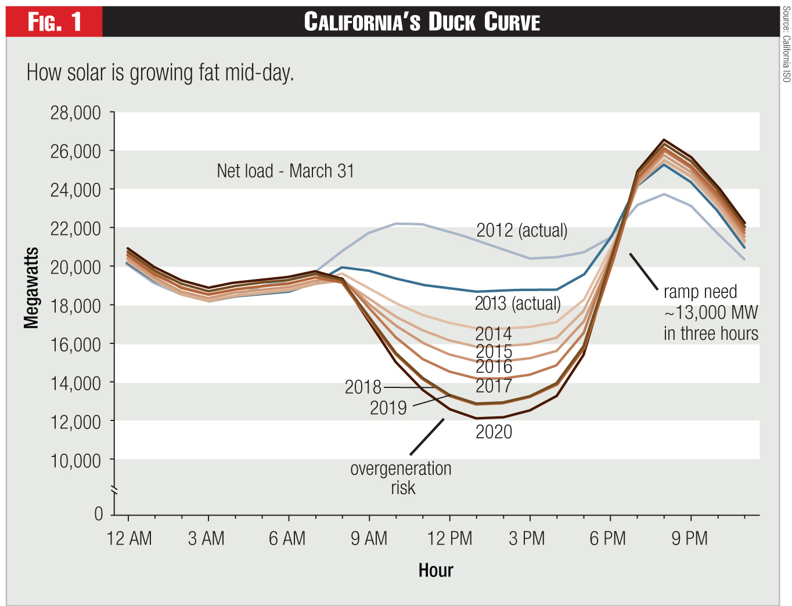

# CloudOverflow

# Project Title

OSI Hackathon Project

<h2 align="left">
Table of Contents
</h2>

<b>1. Intro:</b> Talk about your idea and the    specific problem you are trying to solve.

2. Demo – Show off what you have achieved in the hackathon.

3. Looking forward – Talk about how you would continue to develop the project given more time and your vision 
for a more complete tool.

4. Technologies – Talk about any frameworks/libraries you use and why you chose them.

1. Intro – Talk about your idea and the specific problem you are trying to solve.
    The problem we are trying to address is flattening the duck curve.
    
2. Demo – Show off what you have achieved in the hackathon.
3. Looking forward – Talk about how you would continue to develop the project given more time and your vision 
for a more complete tool.
4. Technologies – Talk about any frameworks/libraries you use and why you chose them.

# About

# Demo
## data_create_test.py 
- Creates data that we could be getting from the grid in mW, total load on the grid
- Manually put in the data
- Based it on California mW 

- 

# Looking Forward

# Technologies

Overview
- we have many devices at home that charge throughout the day and thats it
- Problem is that the duck curve shows when there is a peak time of solar and wind energy GENERATED is during the times of 9 AM to 5:30 PM and there is nothing to load it 
- Solution is to create HARDWARE (that reads/writes load and generation) and SOFTWARE that loads devices during those times and give the ability to customers to sell their Load  (minnimum 20%) after 6 PMm (under the assumption that the power is generated through solar and wind)
    - We take data from two different datasets and compare it to a duck curve
        Data Set 1 = House Data
            -- Total House mW Capacity
            -- Total House mW Output
      
        Data Set 2 = Grid Data
            -- Time 
            -- mW
    - We try to figure out optimal time to charge, discharge, and sell based on the datasets

Business Aspects:

- Hardware one time fee
- Discount on electricity bill
- Sell Load
- Charge based on Load

TO ADD
    Info on terms:
        FEP:
        RTU: Stands for remote terminal unit. Monitors and or controls field devices and reports back to a power plant.
        Generation
        Load
        Idle
        Charge
        Discharge
        Duck Curve
        House Data
        Grid data
        IOT

    Selling point:
        Scalability
        Mudularity

    Drawings/pictures/diagrams:
        four prong outlet with No control, medium control, full control button
        plug -> house hub -> RTU -> Power Company
        Power Company -> RTU -> house hub -> plug

    Future work:
        Theoretical standards
        APIs that we could plug into
        Standards we could/should adhere to

<h2><b>Contributers</b></h>
<h3>Abdinasir Mumin</h3>
<h3>Brenden Chermack</h3>
<h3>Calvin Schemeichal</h3>
<h3>Sharveen Paramiswaran</h3>
<h3>William Munnich</h3>
>>>>>>> main
